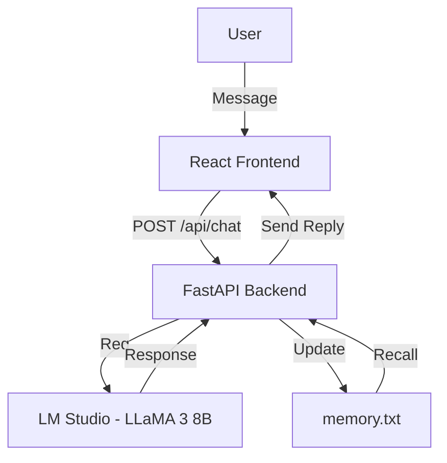

# GOKU-AI-CHATBOT

> **Project Z — Intelligent Character Chat System powered by FastAPI, React & LM Studio**

---

## 🧠 Overview

**GOKU AI** is a modular, locally hosted **intelligent character chat system** that brings fictional personalities to life using **FastAPI**, **React**, and **LLaMA-3 (8B Instruct)** through **LM Studio**.

It demonstrates complete **end-to-end AI integration** — combining backend logic, frontend design, and local model inference — to emulate personality-driven, memory-based conversations.  
The first character implemented is **Son Goku** from *Dragon Ball*.

Built as part of **Project Z**, this system lays the groundwork for a **multi-character conversational universe**, where each AI has its own memory, knowledge, and tone.

---

## 🎯 Project Summary

| Version | Description | Key Tech |
| :------ | :----------- | :-------- |
| [V.0 — Prototype](https://github.com/GKTHIRUMARAN/GOKU-AI-CHATBOT/tree/main/V.0) | Gradio-based proof of concept using LM Studio and text memory. | Python, Gradio, LLaMA-3 |
| [V.1 — Full Build](https://github.com/GKTHIRUMARAN/GOKU-AI-CHATBOT/tree/main/V.1) | FastAPI + React full implementation with persistent memory and persona system. | FastAPI, React, Tailwind, Zustand |

---

## 🧩 Core Features

- ⚙️ **Full-Stack Pipeline:** React → FastAPI → LM Studio → Memory → UI Response  
- 🧠 **Personality Engine:** Emulates Goku’s tone, humor, and confidence  
- 💾 **Persistent Memory:** Remembers past conversations for context  
- 📚 **Knowledge Integration:** Uses curated lore from the Dragon Ball universe  
- 🧰 **Modular Architecture:** Swap or expand characters easily  
- 🚀 **Local or Cloud Ready:** Runs locally or via containerized deployment  

---

## 🏗️ System Architecture

---

## 🔍 Technical Stack

| Layer                | Technology                  | Purpose                                       |
| :------------------- | :-------------------------- | :-------------------------------------------- |
| **Frontend**         | React + Vite + Tailwind CSS | Modern, responsive chat interface             |
| **Backend**          | FastAPI                     | Manages API routes, memory, and persona logic |
| **Model Interface**  | LM Studio (LLaMA-3 8B)      | Local model inference engine                  |
| **State Management** | Zustand                     | Frontend global chat state                    |
| **API Client**       | Axios                       | Handles data flow between UI & backend        |
| **Styling & UX**     | Tailwind + Framer Motion    | Interactive and smooth animations             |

---

## 📁 Repository Modules

| Folder                                                                  | Purpose                                                                        |
| :---------------------------------------------------------------------- | :----------------------------------------------------------------------------- |
| [`/V.0`](https://github.com/GKTHIRUMARAN/GOKU-AI-CHATBOT/tree/main/V.0) | Prototype Gradio chatbot using text-based persona, memory, and knowledge files |
| [`/V.1`](https://github.com/GKTHIRUMARAN/GOKU-AI-CHATBOT/tree/main/V.1) | Full-scale build with FastAPI backend and React frontend                       |

---

## 💬 Example Interaction

> **User:** Hey Goku, how’s your training today?
> **Goku:** Haha! Training never stops! I just did 10,000 push-ups — gotta keep my power level high even in this AI realm!

  

---

## 🧠 Evolution Path

| Stage | Goal                                 | Status         |
| :---- | :----------------------------------- | :------------- |
| V.0   | Gradio prototype with memory         | ✅ Complete     |
| V.1   | Full FastAPI + React build           | ✅ Complete     |
| V.2   | Multi-Character RAG System (Planned) | 🔜 In progress |

---

## 🧩 Future Roadmap

* 🔹 Multi-character expansion (Vegeta, Piccolo, etc.)
* 🔹 Vector memory with **FAISS / ChromaDB**
* 🔹 Rich UI with persona selector & memory viewer
* 🔹 Dockerized full-stack deployment
* 🔹 Integration with external APIs for dynamic data responses

---

## 📘 Architecture Philosophy

GOKU-AI is built around **persona-centric intelligence** — every character is self-contained with:

1. **Prompt personality** (`prompt.txt`)
2. **Knowledge base** (`knowledge.txt`)
3. **Memory persistence** (`memory.txt`)

This modular design ensures each AI maintains its own story, growth, and emotional context within conversations.

---

## 🪐 Project Ecosystem

| Module                       | Description                                       | Link                                                                        |
| :--------------------------- | :------------------------------------------------ | :-------------------------------------------------------------------------- |
| 🧩 **Prototype Build (V.0)** | Gradio-based Goku chatbot — foundational version. | [Open → V.0](https://github.com/GKTHIRUMARAN/GOKU-AI-CHATBOT/tree/main/V.0) |
| ⚡ **Full Build (V.1)**       | FastAPI + React single-character implementation.  | [Open → V.1](https://github.com/GKTHIRUMARAN/GOKU-AI-CHATBOT/tree/main/V.1) |

---

## 📜 License

Licensed under the [MIT License](https://github.com/GKTHIRUMARAN/GOKU-AI-CHATBOT/blob/main/LICENSE).

---

## 👤 Author

**GK Thirumaran**  
🎓 *B.Tech — Artificial Intelligence and Data Science*  
🌍 *Coimbatore, Tamil Nadu, India*  
💼 *Aspiring Data Scientist & Analyst | AIML Developer*  
🔗 [LinkedIn](https://www.linkedin.com/in/thirumarangk-ai) | [Portfolio](https://maranthiru180.wixsite.com/my-site)
