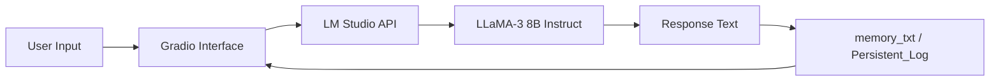

# 🧩 GOKU-AI-CHATBOT — V.0 Prototype Build

> **Project Z — Persona-Driven Conversational AI (Gradio + LM Studio Prototype)**  
> The foundation of the *Goku AI Chatbot Universe.*


---

## 🧠 Overview

**GOKU AI (V.0)** marks the **first working prototype** of the *Project Z* initiative — a **persona-driven AI chatbot** that emulates **Son Goku** from *Dragon Ball* using **LM Studio (Meta LLaMA 3 8B Instruct)** as its core model.

This version focuses on **local execution, modular design, and character consistency**, built entirely with **Python + Gradio**. It demonstrates early-stage memory, persona, and knowledge integration for conversational persistence.

---

## 🎯 Objective

To create a **personalized AI character system** capable of:

- Responding in Goku’s tone and style  
- Remembering past chats via text-based memory  
- Integrating curated lore into contextual dialogue  
- Serving as the **foundation** for future RAG-based multi-character builds

---

## ⚙️ Tech Stack

| Layer              | Tool / Library                               | Description |
| ------------------ | -------------------------------------------- | ------------ |
| **Model Backend**  | **Meta LLaMA 3 8B Instruct (via LM Studio)** | Core LLM providing persona-aligned text generation |
| **Frontend**       | **Gradio**                                   | Simple, shareable web UI for chat interaction |
| **Development**    | **Python + Jupyter Notebook**                | Rapid prototype & test environment |
| **Memory**         | `memory.txt`                                 | Stores user–AI dialogue history |
| **Persona Prompt** | `prompt.txt`                                 | Defines Goku’s personality and tone |
| **Knowledge Base** | `knowledge.txt`                              | Contains curated lore for contextual replies |

---

## 🧩 Core Features

- 🗣️ **Persona Engine** — Replies like Goku; energetic, direct, and humorous  
- 💾 **Memory System** — Persists conversations using `memory.txt`  
- 📚 **Knowledge Integration** — Reads `knowledge.txt` for accurate responses  
- 🧰 **Modular Design** — Swap persona or model easily  
- 🌐 **Deployable Gradio Interface** — Local + public (`share=True`) support  

---

## 🧪 Prototype Flow



---

## 📁 File Structure

```
│   app.py
│   prompt.txt
│   knowledge.txt
│   memory.txt
│   requirements.txt
│   embed_cache.pkl

```

---

## 💬 Example Interaction

> **User:** Hey Goku, how’s your training today?
> **Goku:** Haha! Training never stops — I just finished a thousand push-ups!
> I gotta keep my power level high even in this AI realm!

<p align="center">
  
</p>

---

## 🧠 Internal Logic

1. **Initialize Model:** LM Studio runs the LLaMA-3 8B model locally.
2. **Load Persona:** `prompt.txt` defines tone, style, and vocabulary.
3. **Context Injection:** `knowledge.txt` adds Dragon Ball lore snippets.
4. **User Interaction:** Handled via Gradio web UI (`app.py`).
5. **Memory Update:** All chat history appended to `memory.txt`.
6. **Response Generation:** Model predicts next reply using prompt + context.

---

## 🧱 Key Scripts

| File                   | Role                                                               |
| ---------------------- | ------------------------------------------------------------------ |
| `app.py`               | Core app entrypoint; initializes Gradio UI and handles model calls |
| `prompt.txt`           | Character behavior definitions                                     |
| `knowledge.txt`        | Static world/lore database                                         |
| `memory.txt`           | Persistent conversation log                                        |
| `embed_cache.pkl`      | Development for quick prototyping                                  |

---

## 📘 Example Code Snippet

```python
import gradio as gr
from goku_core import chat_with_goku

def chat_fn(user_input):
    return chat_with_goku(user_input)

iface = gr.Interface(
    fn=chat_fn,
    inputs="text",
    outputs="text",
    title="Goku AI — Prototype Chatbot",
    description="Chat with Goku powered by LLaMA-3 8B via LM Studio",
    theme="gradio/soft"
)
iface.launch(share=True)
```

---

## 🚀 Future Goals (Toward V.1)

| Feature                     | Upgrade Path                                     |
| --------------------------- | ------------------------------------------------ |
| **Backend**                 | Migrate to FastAPI for modular API routes        |
| **Frontend**                | Move from Gradio → React (Vite + Tailwind)       |
| **Memory**                  | Replace text logs with SQLite or JSON DB         |
| **Retrieval**               | Introduce FAISS/Chroma RAG for contextual search |
| **Multi-Character Support** | Add Vegeta, Piccolo, etc.                        |

---

## ✅ Outcome

A functional **proof-of-concept chatbot** demonstrating:

* Persona-driven response behavior
* Persistent conversational memory
* Modular architecture ready for scaling
* Full local execution (no external API costs)

---

## 🔗 Project Links

| Resource               | Link                                                                                  |
| ---------------------- | ------------------------------------------------------------------------------------- |
| 🏠 **Main Repository** | [GOKU-AI-CHATBOT](https://github.com/GKTHIRUMARAN/GOKU-AI-CHATBOT)                    |
| 📂 **V.0 Folder**      | [Prototype Build](https://github.com/GKTHIRUMARAN/GOKU-AI-CHATBOT/tree/main/V.0)      |
| ⚡ **V.1 Folder**       | [Full Build](https://github.com/GKTHIRUMARAN/GOKU-AI-CHATBOT/tree/main/V.1)           |

---

## 🧩 How It Fits in the Whole Project

**V.0** serves as the **prototype core** of *Project Z — Goku AI*, validating the local LLM + memory + persona system that later evolved into the **V.1 full-stack FastAPI + React architecture**.

> 🪴 Think of this version as the seed — everything after it grows from here.

[⬅ Back to Main README](../README.md)

---

## 👤 Author

**GK Thirumaran**  
🎓 *B.Tech — Artificial Intelligence & Data Science*  
🌍 *Coimbatore, India*  
💼 *Full-Stack AI Developer | Data Scientist | System Architect*  
🔗 [LinkedIn](https://www.linkedin.com/in/thirumarangk-ai) | [Portfolio](https://maranthiru180.wixsite.com/my-site)

