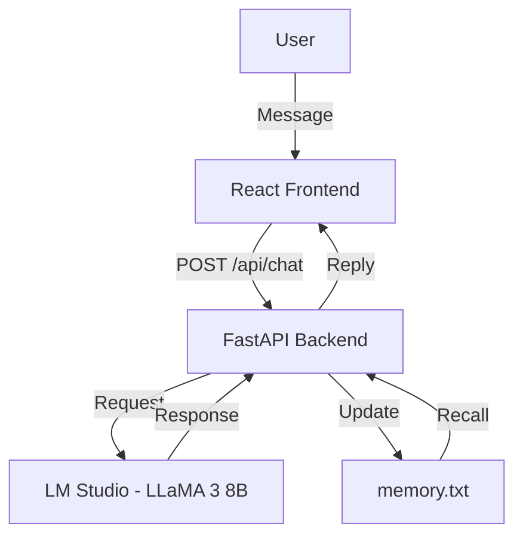

# ⚡ GOKU-AI-CHATBOT — V.1 Full Build

> **Project Z — Intelligent Character Chat System powered by FastAPI, React & LM Studio**  
> The evolution of the *Goku AI Prototype* into a full-stack intelligent persona engine.


---

## 🧠 Overview

**GOKU AI (V.1)** represents the **first complete version** of *Project Z* — a **modular, locally hosted intelligent character chat system**.  
Built with **FastAPI**, **React**, and **LM Studio (LLaMA-3 8B Instruct)**, it enables real-time dialogue between the user and the AI persona **Son Goku**, complete with **persistent memory**, **custom prompts**, and a **frontend chat UI** inspired by ChatGPT.

This version transforms the lightweight prototype from [V.0](https://github.com/GKTHIRUMARAN/GOKU-AI-CHATBOT/tree/main/V.0) into a **scalable full-stack system** ready for multi-character expansion.

---

## 🎯 Core Vision

To create a **personality-driven AI framework** that allows each character to:

- Speak in a unique **tone and style**
- Retain **long-term memory** of conversations
- Draw knowledge from a **character-specific database**
- Operate seamlessly across **frontend, backend, and local model layers**

---

## ⚙️ System Architecture



---

## 🧩 Key Components

| Layer                | Technology                  | Role                                            |
| :------------------- | :-------------------------- | :---------------------------------------------- |
| **Frontend**         | React + Vite + Tailwind CSS | Chat interface and state management             |
| **Backend**          | FastAPI                     | API routing, persona management, memory updates |
| **Model Interface**  | LM Studio (LLaMA-3 8B)      | Local inference for personality-based replies   |
| **Memory**           | Text-based persistence      | Logs past conversations for continuity          |
| **State Management** | Zustand                     | Global state store for messages                 |
| **Networking**       | Axios                       | Handles communication between UI and FastAPI    |

---

## 🧱 Folder Structure

```
V.1/
│
├── backend/
│   ├── main.py
│   ├── api/
│   │   └── chat.py
│   ├── services/
│   │   ├── llm_service.py
│   │   └── character_service.py
│   ├── utils/
│   │   ├── logger.py
│   │   └── file_utils.py
│   ├── characters/
│   │   └── goku/
│   │       ├── prompt.txt
│   │       ├── knowledge.txt
│   │       └── memory.txt
│   └── .env
│
├── frontend/
│   ├── src/
│   │   ├── components/
│   │   │   ├── ChatMessage.jsx
│   │   │   ├── ChatInput.jsx
│   │   │   └── HeaderBar.jsx
│   │   ├── pages/
│   │   │   └── ChatPage.jsx
│   │   ├── store/
│   │   │   └── chatStore.js
│   │   ├── App.jsx
│   │   └── main.jsx
│   └── package.json
│
└── README.md
```

---

## 💬 Example Interaction

> **User:** Hey Goku, how’s your training today?
> **Goku:** Training never stops! I just finished 10,000 push-ups — gotta keep my energy high even in this AI realm!

<p align="center">
  
</p>

---

## ⚡ Backend — FastAPI Core

The **backend** acts as the orchestrator for the entire system — managing requests, persona loading, and LM Studio inference.

### 🔧 Main Components

| File                            | Description                                        |
| :------------------------------ | :------------------------------------------------- |
| `main.py`                       | Initializes FastAPI app and includes API routes    |
| `api/chat.py`                   | Defines `/api/chat` endpoint                       |
| `services/llm_service.py`       | Connects to LM Studio’s REST API                   |
| `services/character_service.py` | Loads character prompt, memory, and knowledge      |
| `utils/logger.py`               | Logs system activity and errors                    |
| `utils/file_utils.py`           | Handles read/write operations for text/JSON memory |

### ✅ Backend Highlights

* Full integration with **LM Studio REST API**
* Dynamic persona loading for each AI character
* Persistent memory system via text files
* Modular architecture for easy multi-character scaling
* Logging for debugging and system insights

---

## 💻 Frontend — React Interface

A **modern chat UI** built with **React + Tailwind + Zustand**, designed for real-time AI conversation.

### ✨ UI Features

* Minimal, responsive layout
* Chat bubbles for user & AI
* Auto-scroll for message history
* Loading animations
* Global chat store via Zustand

### 🧩 Directory Snapshot

```
frontend/
├── src/
│   ├── components/
│   │   ├── ChatMessage.jsx
│   │   ├── ChatInput.jsx
│   │   └── HeaderBar.jsx
│   ├── store/
│   │   └── chatStore.js
│   └── App.jsx
```

---

## 🧰 Environment Setup

**.env**

```bash
LM_STUDIO_URL=http://localhost:1234/v1/chat/completions
MODEL_NAME=LLaMA-3-8B-Instruct
```

**Backend Run**

```bash
uvicorn backend.main:app --reload
```

**Frontend Run**

```bash
cd frontend
npm run dev
```

**Access in Browser**

```
http://127.0.0.1:5173
```

---

## ✅ Current Capabilities

| Feature                  | Status        |
| :----------------------- | :------------ |
| FastAPI API              | ✅ Stable      |
| LM Studio Integration    | ✅ Functional  |
| React Chat UI            | ✅ Complete    |
| Persistent Memory        | ✅ Active      |
| Logging & Error Handling | ✅ Enabled     |
| Single Character (Goku)  | ✅ Implemented |

---

## 🔮 Future Roadmap

| Goal                          | Description                              |
| :---------------------------- | :--------------------------------------- |
| **Multi-Character System**    | Add new personas (Vegeta, Piccolo, etc.) |
| **Memory Database**           | Migrate from text → SQLite or vector DB  |
| **Knowledge Retrieval (RAG)** | Implement FAISS / Chroma                 |
| **UI Expansion**              | Character selector + memory viewer       |
| **Docker Deployment**         | Containerized full-stack build           |

---

## 🧠 Lessons Learned

* LM Studio’s LLaMA models need structured payloads (`max_tokens`, `temperature`)
* React state sync issues fixed with **Zustand**
* Long inference handled via **timeout management**
* Modular backend design simplified scaling
* Logging and file utilities improved traceability

---

## 📜 Project Links

| Resource               | Link                                                                                  |
| :--------------------- | :------------------------------------------------------------------------------------ |
| 🏠 **Main Repository** | [GOKU-AI-CHATBOT](https://github.com/GKTHIRUMARAN/GOKU-AI-CHATBOT)                    |
| 📂 **V.0 Folder**      | [Prototype Build](https://github.com/GKTHIRUMARAN/GOKU-AI-CHATBOT/tree/main/V.0)      |
| ⚡ **V.1 Folder**       | [Full Build](https://github.com/GKTHIRUMARAN/GOKU-AI-CHATBOT/tree/main/V.1)           |
---

## 🧩 How It Fits in the Whole Project

**V.1** is the **first complete implementation** of *Project Z — Goku AI*, building directly on the prototype foundation of [V.0](../V.0/README.md).
It transitions from a Gradio proof-of-concept to a **full production-grade architecture**, paving the way for multi-character RAG-based systems in future versions.

> 🌱 The seed (V.0) has grown — V.1 is its first true form.

[⬅ Back to Main README](../README.md)

---

## 👤 Author

**GK Thirumaran**  
🎓 *B.Tech — Artificial Intelligence & Data Science*  
🌍 *Coimbatore, India*  
💼 *Full-Stack AI Developer | Data Scientist | System Architect*  
🔗 [LinkedIn](https://www.linkedin.com/in/thirumarangk-ai) | [Portfolio](https://maranthiru180.wixsite.com/my-site)
