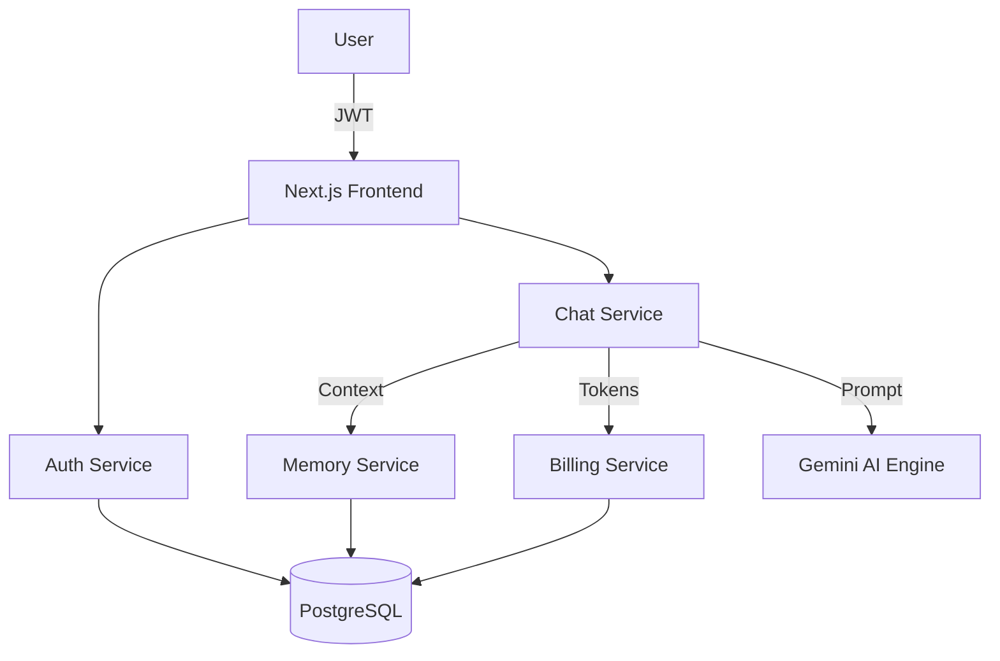

# ⚡ GOKU-AI — V.2 Full Build

> **Project Z — Modular Conversational AI Platform powered by FastAPI, Next.js & Google Gemini**  
> The evolution of Goku AI into a **production-grade, microservices-based AI system**.


---

## 🧠 Overview

**GOKU AI (V.2)** represents a **major architectural leap** in *Project Z* — transforming the earlier monolithic chatbot into a **secure, scalable, microservices-driven conversational AI platform**.

This version introduces a **real-world product mindset**, focusing on authentication, billing enforcement, service isolation, and frontend–backend security.

### 🚀 Key Introductions

- 🔐 **JWT-based secure authentication**
- 🧠 **Memory-aware AI conversations**
- 💳 **Token-based billing enforcement**
- 🤖 **Pluggable AI engine (Gemini-ready)**
- 🐳 **Dockerized backend services**
- 🌐 **Fully wired professional frontend (Next.js)**

Unlike earlier versions, **V.2 is engineered like a real AI product**, not a prototype.

---

## 🎯 Core Vision

To build a **long-term, extensible conversational AI platform** where:

- Each persona has **distinct behavior and memory**
- Conversations **persist across sessions**
- AI usage is **measured, limited, and enforceable**
- Backend services **scale independently**
- Frontend integrates **securely with backend APIs**
- The system is **cloud-deployment ready**

---

## ⚙️ System Architecture



---

## 🧩 Key Components

| Service Layer       | Technology                 | Responsibility                          |
| :------------------ | :------------------------- | :-------------------------------------- |
| **Frontend**        | Next.js 14 + Tailwind CSS  | UI, authentication flow, chat interface |
| **Auth Service**    | FastAPI + JWT + PostgreSQL | Signup, login, token issuance           |
| **Chat Service**    | FastAPI + Gemini           | AI orchestration & prompt handling      |
| **Memory Service**  | FastAPI + PostgreSQL       | Short & long-term conversation memory   |
| **Billing Service** | FastAPI                    | Token usage tracking & enforcement      |
| **AI Engine Layer** | Google Gemini (pluggable)  | AI inference                            |
| **Infrastructure**  | Docker + Docker Compose    | Local production parity                 |

---

## 🧱 Folder Structure

```
V.2/
│
├── services/
│   ├── auth-service/
│   ├── chat-service/
│   ├── memory-service/
│   └── billing-service/
│
├── goku-ai-frontend/
│   ├── app/
│   ├── components/
│   ├── lib/
│   ├── styles/
│   └── package.json
│
├── infra/
│   └── docker-compose.yml
│
└── README.md
```

---

## 💬 Example Interaction

> **User:** Hello Goku, how are you today?
> **Goku:** Hello. I am here. What will we focus on today?

> *(Conversation grounded using persona prompt and memory context)*

<p align="center">
  
</p>

---

## ⚡ Backend — Microservices Core

Each backend service is **independently deployable**, **health-checked**, and **secured**.

### 🔧 Services Breakdown

| Service             | Description                                           |
| :------------------ | :---------------------------------------------------- |
| **Auth Service**    | User authentication, JWT issuance, password hashing   |
| **Chat Service**    | Prompt construction, memory grounding, billing checks |
| **Memory Service**  | Conversation history & long-term memory               |
| **Billing Service** | Token estimation & usage enforcement                  |

### ✅ Backend Highlights

* JWT-secured APIs
* Billing enforcement **before AI inference**
* Memory injected directly into AI prompts
* Retry & backoff handling for AI overload
* Docker-hardened runtime (non-root containers)
* Health & readiness probes

---

## 💻 Frontend — Next.js Interface

A **modern, professional UI** built using **Next.js App Router**.

### ✨ UI Features

* Secure login & signup
* Protected routes (`/chat`)
* Persistent JWT sessions
* Persona-aware chat UI
* Sidebar + top-bar layout
* Clean, dark-theme design

### 🧩 Frontend Structure

```
goku-ai-frontend/
├── app/
│   ├── (auth)/
│   ├── (protected)/
│   └── layout.tsx
│
├── components/
│   ├── layout/
│   └── chat/
│
├── lib/
│   ├── api.ts
│   ├── auth.ts
│   ├── chat.ts
│   ├── storage.ts
│   └── guards.ts
│
└── styles/
```

---

## 🐳 Infrastructure & Deployment

* Fully Dockerized services
* Multi-stage builds
* Non-root container execution
* Health-based startup ordering
* Local development mirrors production layout

### ▶️ Run Locally

```bash
docker compose up -d
```

**Frontend**

```bash
cd goku-ai-frontend
npm install
npm run dev
```

**Access**

```
Frontend: http://localhost:3000
Auth:     http://localhost:8001
Chat:     http://localhost:8000
```

---

## ✅ Current Capabilities (V.2)

| Feature                        | Status |
| :----------------------------- | :----- |
| Secure Authentication          | ✅      |
| AI Chat (Gemini)               | ✅      |
| Memory Injection               | ✅      |
| Billing Enforcement            | ✅      |
| Dockerized Microservices       | ✅      |
| Frontend ↔ Backend Integration | ✅      |
| Health & Readiness Probes      | ✅      |

---

## 🔮 Future Roadmap

| Goal                         | Description            |
| :--------------------------- | :--------------------- |
| Streaming AI responses       | SSE / WebSocket        |
| Memory summarization & decay | Long-term optimization |
| Persona intelligence upgrade | Less robotic behavior  |
| Analytics dashboard          | Usage insights         |
| Cloud deployment             | AWS / GCP              |
| CI/CD pipeline               | GitHub Actions         |

---

## 🧠 Lessons Learned

* Microservices require **clear service contracts**
* Billing must be enforced **before inference**
* Memory improves context but requires curation
* Docker hardening prevents runtime failures
* Many frontend auth issues originate from **CORS & token flow**
* Stability always outweighs flashy features

---

## 🧩 How It Fits in Project Z

**V.2** marks the transition from *application* to **platform**.

* **V.0** → Prototype
* **V.1** → Full-stack monolith
* **V.2** → Modular, production-ready AI platform
* **V.3+** → Intelligence evolution *(planned)*

> 🧠 **V.2 is the backbone. Intelligence evolves next.**

[⬅ Back to Main README](../README.md)

---

## 👤 Author

**GK Thirumaran**  
🎓 *B.Tech — Artificial Intelligence & Data Science*  
🌍 *Coimbatore, Tamil Nadu, India*  
💼 *Aspiring Data Scientist & Analyst | AIML Developer*  
🔗 [LinkedIn](https://www.linkedin.com/in/thirumarangk-ai) | [Portfolio](https://maranthiru180.wixsite.com/my-site)

